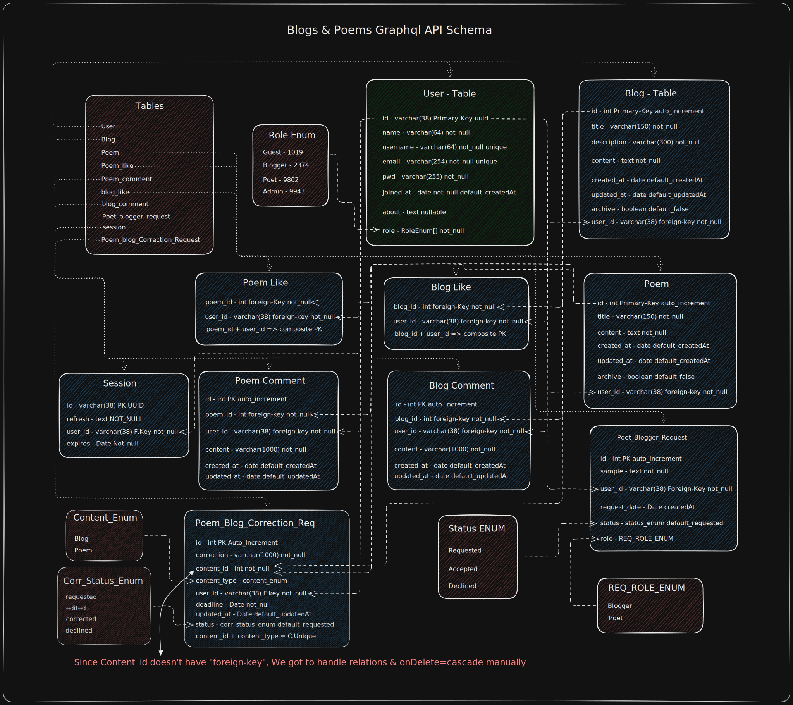

# Blogs & Poems - Graphql API Server

Learning Graphql API by building an Simple-Mini-Blogging-API where there are 4 roles:

- Guest
- Blogger
- Poet
- Admin

**And their functionalities are:**

- Guest can Read Blogs and Poems. And also leave comments and likes. And can also read an blog's comments. And can also see like counts. And also fill out a form to be a Poet or Blogger by providing an Sample Poem/Blog
- Blogger can Write, Edit and Delete their Blogs and view their blog's comments or like counts
- Poet can Write, Edit and Delete their Poems and view their poem's comments or like counts
- Admin can Delete any Blogs or Poems, Make anyone a Poet or Blogger
- Admin can also inform Poets/Bloggers to make changes to the Poets/Bloggers Blogs

## Schema:
